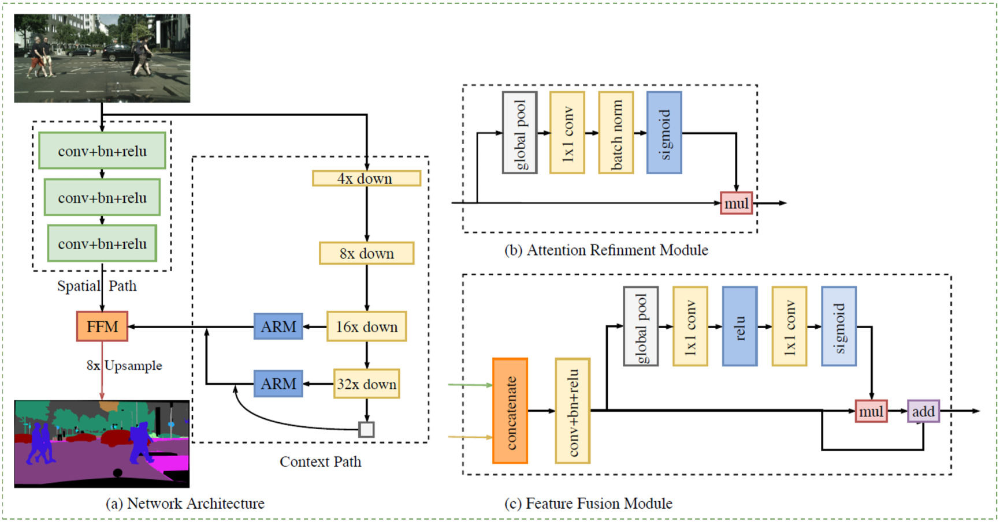
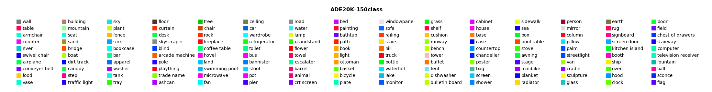

# BiSeNet-CCP

In this project, we use BiSeNet as our backbone network to finish scene segmentation task, then use Connected Components Decision to Postprocess scene segmentaion results to finish instance segmentation task.

The details can be accessed in [CV_Poster.pdf](CV_Poster.pdf).

## Bilateral Segmentation Network (BiSeNet)
Bilateral Segmentation Network (BiSeNet) is designed to segment scenes in Real-time, proposed by Face++.
- PAPER: [BiSeNet: Bilateral Segmentation Network for Real-time Semantic Segmentation](https://arxiv.org/abs/1808.00897)
- CODE: https://github.com/ooooverflow/BiSeNet

The BiSeNet architure is shown as below.

## Connected Components Postprocessing
To extend scene segmentation to instance segmentation, we use 8-connected components decision to postprocess the BiSeNet outputs. The connected components theory is shown as below.

The idea is quite easy.

- **As the segmentation result of each class is a Binary Image, Connected Components Decision can be used to segment the class superpixel to instance superpixels.**
- **Some noises can be suppressed by removing some very small connected components.**

## Our Results (scene & instance)

Database links:
- ADE20K: http://groups.csail.mit.edu/vision/datasets/ADE20K/
- SUN-RGBD: http://rgbd.cs.princeton.edu/

Models can be found at [Baiduyun](https://pan.baidu.com/s/1qMLJXWTsTttOCaB_NSrnbw).

### ADE20K

<table>
	<tr>
		<th>
Raw Image
</th>
		<th>
Ground Truth
</th>
		<th>
Scene
</th>
		<th>
Instance
</th>
	</tr>
	<tr>
		<td>

</td>
		<td>

</td>
		<td>

</td>
		<td>

</td>
	</tr>
	<tr>
		<td>

</td>
		<td>

</td>
		<td>

</td>
		<td>

</td>
	</tr>
	<tr>
		<td>

</td>
		<td>

</td>
		<td>

</td>
		<td>

</td>
	</tr>
</table>

### SUN-RGBD

<table>
	<tr>
		<th>
Raw Image
</th>
		<th>
Ground Truth
</th>
		<th>
Scene
</th>
		<th>
Instance
</th>
	</tr>
	<tr>
		<td>

</td>
		<td>

</td>
		<td>

</td>
		<td>

</td>
	</tr>
	<tr>
		<td>

</td>
		<td>

</td>
		<td>

</td>
		<td>

</td>
	</tr>
	<tr>
		<td>

</td>
		<td>

</td>
		<td>

</td>
		<td>

</td>
	</tr>
	<tr>
		<td>

</td>
		<td>

</td>
		<td>

</td>
		<td>

</td>
	</tr>
</table>

## References

Bisenet: Bilateral segmentation network for real-time semantic segmentation. Yu, Changqian, et al. European Conference on Computer Vision. Springer, Cham, 2018. (https://arxiv.org/pdf/1808.00897.pdf)

Sun rgb-d: A rgb-d scene understanding benchmark suite. Song, Shuran, Samuel P. Lichtenberg, and Jianxiong Xiao. Proceedings of the IEEE conference on computer vision and pattern recognition. 2015. (http://rgbd.cs.princeton.edu/paper.pdf)

Scene Parsing through ADE20K Dataset. Bolei Zhou, Hang Zhao, Xavier Puig, Sanja Fidler, Adela Barriuso and Antonio Torralba. Computer Vision and Pattern Recognition (CVPR), 2017. (http://people.csail.mit.edu/bzhou/publication/scene-parse-camera-ready.pdf)

	@inproceedings{zhou2017scene,
	    title={Scene Parsing through ADE20K Dataset},
	    author={Zhou, Bolei and Zhao, Hang and Puig, Xavier and Fidler, Sanja and Barriuso, Adela and Torralba, Antonio},
	    booktitle={Proceedings of the IEEE Conference on Computer Vision and Pattern Recognition},
	    year={2017}
	}